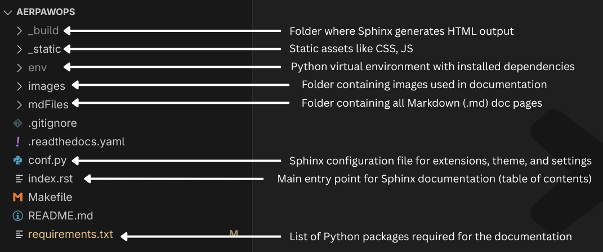
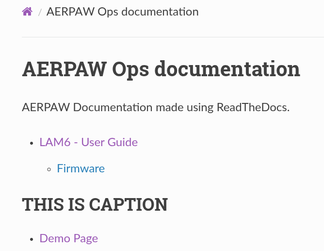

## Build instructions

Clone the repo first:
```console
git clone https://github.com/aayamrajshakya/aerpawops.git
```

Change directory into the cloned repo:
```console
cd aerpawops/
```

Create a virtual environment and activate it:
```console
python3 -m venv env
source env/bin/activate
```

Now, install all the required dependencies:
```console
pip install -r requirements.txt
```

Open the project directory in a text editor.



> [!NOTE]
> Since we are using the `myst-parser` package, we don’t need to use `.rst` files to build the pages as we did previously. Markdown works fine, but it is recommended to keep the index file in `.rst` format.

For ease, run the live-reload Sphinx server; this will show live updates as you edit the docs files:
```console
cd aerpawops/
sphinx-autobuild . _build/html/
```

Then, open [http://127.0.0.1:8000/](http://127.0.0.1:8000/) in your browser to see live updates.

To create a page, go into the mdFiles folder and create a `.md` file (for example, demo.md) with a simple title, like `# Sample Title`. You can then view the rendered HTML page at [http://127.0.0.1:8000/mdFiles/demo.html](http://127.0.0.1:8000/mdFiles/demo.html).

To add the newly created page in TOC, go to `index.rst` and add:
```rst
.. toctree::
   :maxdepth: 1
   :caption: THIS IS CAPTION
   :titlesonly:

   Demo Page <mdFiles/demo.md>
```

Here, `Demo Page` is the title of the page, and `<mdFiles/demo.md>` is the source file for the page.
Adding `:caption:` is optional. 



