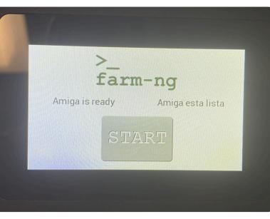
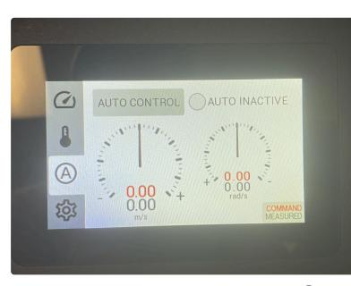
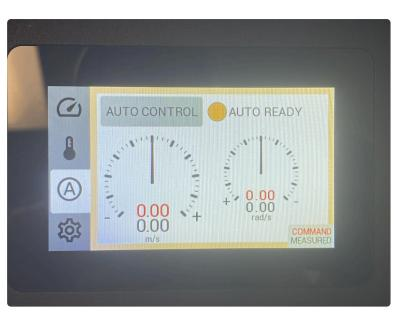
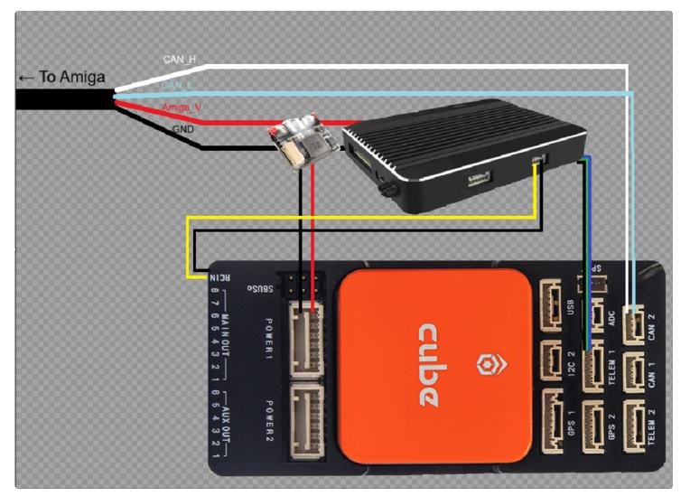
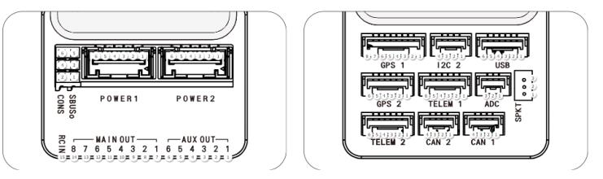

# Amiga Ardurover Integration


Ardurover communicates with the Amiga through CANBus. CAN messages were derived from farm-ng's [Amiga Microcontroller Kit code](https://github.com/farm-ng/amiga-dev-kit/tree/main/circuitpy). The Pixhawk Cube's CAN messages are sent through a [Lua script](https://ardupilot.org/rover/docs/common-lua-scripts.html) (attached above).

## Setup

1. Install Ardurover firmware onto the Cube [guide](https://ardupilot.org/rover/docs/common-loading-firmware-onto-pixhawk.html)  
2. Edit parameters based on the [Ardupilot Settings](https://aerpaw-uav.atlassian.net/wiki/spaces/VD/pages/203227138/Amiga+Ardurover+Integration#Ardupilot-Settings) section of this guide 
3. On a MicroSD card, move the AMIGA_Can.lua file from the top of this page to the `APM/scripts` directory. If it doesn’t exist you can
create that directory. Insert the MicroSD card in the Cube.  
4. Connect wires together based on the [Wiring](https://aerpaw-uav.atlassian.net/wiki/spaces/VD/pages/203227138/Amiga+Ardurover+Integration#Wiring) section of this guide  

## Operation

On startup, the Amiga must be set to AUTO READY mode. Without this setting, the Amiga will not accept external CANBus commands.

<div align="center">

  

*Start screen of the Amiga*  



*Auto control screen. To get here, select the Ⓐ icon on the left side.*



*Enable Auto control with the button on the top. Once the circle is orange, Ardupilot can communicate with the Amiga.*

</div>

## Wiring

<div align="center">
  


*Wiring Overview*



Cube module pinout ([source](https://docs.cubepilot.org/user-guides/autopilot/the-cube-module-overview))

</div>


### Skydroid Power + SBUS Cable

| Skydroid H16 Pin (POW+SBUS Port) | Cube or Cable Pin                              |
|----------------------------------|-----------------------------------------------|
| 1 (GND)                          | Amiga GND (output from power module)          |
| 2 (VBUS)                         | Amiga Voltage (output from power module, 24V) |
| 3 (GND)                          | Cube RCIN “-”                                 |
| 4 (SBUS)                         | Cube RCIN “S”                                 |

### Telemetry Cable

| Skydroid H16 Pin (UART 0 Port) | Cube Module Pin (TELEM 1 Port) |
|--------------------------------|--------------------------------|
| 1 (GND)                        | 6 (GND)                        |
| 2 (TX)                         | 3 (RX)                         |
| 3 (RX)                         | 2 (TX)                         |


### CAN Bus Cable

| Cube Module Pin (CAN 2 Port) | Amiga Cable Pin        |
|-------------------------------|-----------------------|
| 2 (CAN_H)                     | Amiga CAN_H (white)   |
| 3 (CAN_L)                     | Amiga CAN_L (blue)    |


#### Cube Power Cable

| Cube Module Pin (POWER 1 Port) | [Holybro PM02](https://holybro.com/products/pm02-v3-12s-power-module) Power Module |
|--------------------------------|-----------------------------------------------------------------------------------|
| 1 (5V)                          | 1 (5V)                                                                             |
| 2 (5V)                          | 2 (5V)                                                                             |
| 3 (Current_Sense)               | 3 (I)                                                                              |
| 4 (Voltage_Sense)               | 4 (V)                                                                              |
| 5 (GND)                         | 5 (G)                                                                              |
| 6 (GND)                         | 6 (G)                                                                              |


### Ardupilot Settings

Parameters different from default:

`BRD_SAFETYENABLE = 0` Because there’s no safety switch, this must be off to allow throttle control when armed.

`CAN_D2_PROTOCOL = 10` Sets CAN 2 to scripting

`CAN_P2_BITRATE = 250000` Sets CAN 2’s baud rate to match Amiga’s

`CAN_P2_DRIVER = 2` Sets CAN 2 to the secondary driver

`RC1_REVERSED = 1` Reverses input for throttle stick

`RC3_REVERSED = 1` Reverses input for steering stick

`SCR_ENABLE = 1` Enables scripts

### **Explanation of how CAN messages were built from farm-ng’s code:**

CAN Messages were derived from the hello_main_loop example code from Github:

<u>ID</u>

code.py, line 63:

```py
id=CanOpenObject.RPDO1 | DASHBOARD_NODE_ID
```

cobid.py, line 11: `RPDO1 = 0x200`

packet.py, line 12: `DASHBOARD_NODE_ID = 0xE`

**CAN ID = 0x20E**

### <u>Speed and Angle Data</u>

code.py, line 64:

```py
data=AmigaRpdo1(state_req=self.request_state, cmd_speed=self.cmd_speed, cmd_ang_rate=self.cmd_ang_rate).encode()
```

The requested state is `STATE_AUTO_READY` when the rover is supposed to be stationary and `STATE_AUTO_ACTIVE` when the
rover is moving. These macros are assigned `4` and `5` respectively.

in hello_main_loop, `cmd_speed` and `cmd_ang_rate` are incremented by 0.1 when the w key is pressed and decremented by 0.1
when s is pressed.

packet.py, lines 161-170 contain the code for AmigaRpdo1.encode() and calls [pack()](https://docs.python.org/3/library/struct.html#struct.pack) with the following (assuming the state is
`STATE_AUTO_ACTIVE and cmd_speed=1.0 and cmd_ang_rate = 0.2)` :

`pack(<BhhBBx, 5, 1.0*1000, 0.2*1000,0,0)`

where <BhhBBx means little endian data sent as a sequence: uchar, short, short, uchar, uchar, pad byte (0)

**So the final (hexadecimal) data sent is: 05 E8 03 C8 00 00 00 00**

Note: Command data does expire within the Amiga. If you don’t send updated speed/angle data often, the Amiga will return to stopped.
The Python code sends this data every 50ms (code.py, line 18)

Note: When the first byte sent is 0x04 `( STATE_AUTO_READY )`, the speed and angle rates are ignored by the Amiga and the rover is
stopped.
