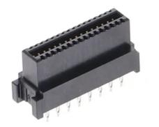
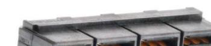
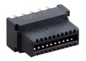
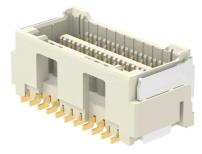

## Integrated Payload / Smart Battery Connector Standard

<table>
  <tr>
    <td align="center" valign="top">

**Payload**  

[Molex LPHpower 461130321 Digikey](https://www.molex.com/molex/products/part-detail/pcb_receptacles/0461130321)

| Pin Top Row | Function | Function | Pin Bot Row |
|------------------|----------|----------|------------------|
| 1  | GND       | CAN_H      | 2  |
| 3  | ETH_TXP   | CAN_L      | 4  |
| 5  | ETH_TXN   | GPS_PPS    | 6  |
| 7  | GND       | CAPTURE    | 8  |
| 9  | ETH_RXP   | I2C_SCL    | 10 |
| 11 | ETH_RXN   | I2C_SDA    | 12 |
| 13 | GND       | 5V         | 14 |
| 15 | USB DP    | 5V         | 16 |
| 17 | USB DM    | GND        | 18 |
| 19 | USB_VBUS  | GND        | 20 |
| 21 | TRIG      | GND        | 22 |
| 23 | GND       | GND        | 24 |
| 25 | UART_TX   | V_BATT+    | 26 |
| 27 | UART_RX   | V_BATT+    | 28 |
| 29 | GND       | V_BATT+    | 30 |
| 31 | S_BUS     | V_BATT+    | 32 |

</td>
<td align="center" valign="top">

**Battery High Current**  

[Molex LPHpower 461120801 Digikey](https://www.molex.com/en-us/products/part-detail/461120801)

| PinTopRow | Function | Function | PinBotRow |
|-------------------|--------------|--------------|-------------------|
| 1                 | V_BATT+  | GND          | 2                 |
| 3                 | V_BATT+  | GND          | 4                 |
| 5                 | V_BATT+  | GND          | 6                 |
| 7                 | V_BATT+  | GND          | 8                 |

</td>
  </tr>
</table>

<table>
  <tr>
    <td align="center" valign="top">

**Battery CANBUS & Balance**  

[Molex LPHpower 461130201 Digikey](https://www.molex.com/en-us/products/part-detail/461130201)

| Pin Top Row | Function   | Function   | Pin Bot Row |
|------------------|------------|------------|------------------|
| 1  | C_1         | C_2        | 2  |
| 3  | C_3         | C_4        | 4  |
| 5  | C_5         | C_6        | 6  |
| 7  | C_7         | C_8        | 8  |
| 9  | C_9         | C_10       | 10 |
| 11 | C_11        | C_12       | 12 |
| 13 | CAN_H       | I2C_SCL    | 14 |
| 15 | CAN_L       | I2C_SDA    | 16 |
| 17 | 5V_IN       | GND        | 18 |
| 19 | Detect_OUT  | Detect_IN  | 20 |

</td>
<td align="center" valign="top">

**Intermediate Breakout Connector**

[Molex Clik-Mate 5054062260 Digikey](https://www.molex.com/molex/products/part-detail/pcb_receptacles/5054062260)

| Pin Top Row | Function   | Function   | Pin Bot Row |
|------------------|------------|------------|------------------|
| 1  | ETH_TXP     | CAN_H      | 2  |
| 3  | ETH_TXN     | CAN_L      | 4  |
| 5  | ETH_RXP     | I2C_SCL    | 6  |
| 7  | ETH_RXN     | I2C_SDA    | 8  |
| 9  | USB DP      | UART_TX    | 10 |
| 11 | USB DM      | UART_RX    | 12 |
| 13 | USB_VBUS    | S_BUS      | 14 |
| 15 | TRIG        | GPS_PPS    | 16 |
| 17 | CAPTURE     | RES        | 18 |
| 19 | RES         | RES        | 20 |
| 21 | 5V          | 5V         | 22 |

</td>
  </tr>
</table>
