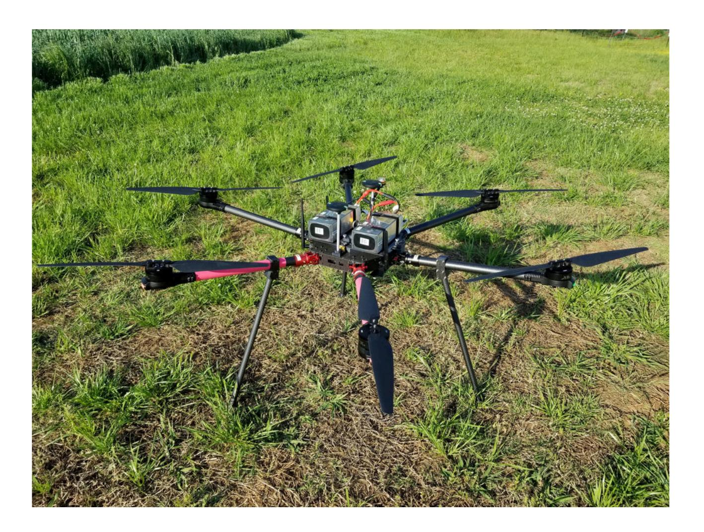

## Airframe Design Overview

### Motor Arm Assembly

The motor arm assembly contains the integrated Motor / ESC system, 30mm carbon fiber arm
tube, the folding arm joint, and the power and data cables to the ESC. It is recommended to
build these first, the construct the center body around them, as the folding joints act as spacers
for the main frame plates.

2 Sets of motor arms near end of production

