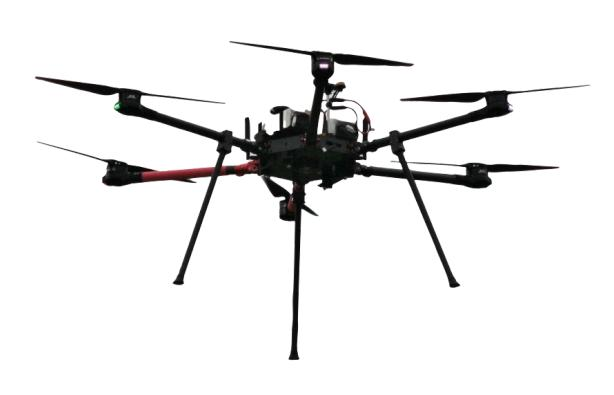

## LAM6 - User Guide

THIS PAGE IS UNDER CONSTRUCTION THERE IS NO GUARANTEE TO THE ACCURACY OF THE INFORMATION

The LAM6 or Large Aerpaw Multirotor (6 rotor) is a custom design and in-house built heavy lift
hexarotor UAV designed around usage for AEPAW operations.


### Summary

<span id="page-0-0"></span>

The LAM6 is designed to maximize flight time
with a 3 Kg payload, but can carry payloads
upwards of 10Kg. The flight controller is based on
the open source [ArduCopter project](https://ardupilot.org/). The quick
attach payload adapter allows easy mechanical
attachment of a standardized payload sled that
can be modified to many uses. The drone was
designed to utilize as many in-house manufacturable parts as possible to reduce supply
constraints and make it economical and fast to make repairs and upgrades.

Notable Features:
- 47 min flight time with no payload and 2 x 25Ah Tattu LiHV batteries.
- 35 min flight time with 3Kg payload and 2 x 25Ah Tattu LiHV batteries.
- Downward folding arms for transportation.
- Controllable through standard [MAVLINK](https://mavlink.io/en/) commands over USB connection to payload.
- Six 23 inch rotors.
- Two quick attach battery mounting plates for faster and more secure attachment.
- RTK GPS capable.
- Uses the [Herelink](http://www.proficnc.com/all-products/211-herelink.html#) control and telemetry system providing control, data, and video (if camera added) up to 20 Km LOS range.
- 12 Kg payload with standard battery configuration at 25 Kg takeoff weight (max sUAS without waiver).
- Can be fitted with configurable voltage output payload power supply (5 ~ 28V @ 12.5A), XT30 output connection.
- Features Navigation lights and anti-collision strobe.

#### Contents

- [Summary](#page-0-0)
- [Specifications](#page-1-0)
  - [Air Frame](#page-1-1)
  - [Electronics](#page-1-2)
  - [Ground Equipment](#page-1-3)
  - [Batteries](#page-1-4)
- [Flight Time](#page-1-5)
- [Operation](#page-1-6)
- [Software / Firmware Configuration](#page-1-7)
  - [Parameters](#page-1-8)
- [Maintenance](#page-2-0)

### Specifications

<span id="page-1-0"></span>

Air Frame Electronics

<span id="page-1-1"></span>Ground Equipment Batteries

<span id="page-1-4"></span><span id="page-1-2"></span>

<span id="page-1-3"></span>Flight Time

Operation

Software / Firmware Configuration

<span id="page-1-8"></span><span id="page-1-7"></span><span id="page-1-6"></span><span id="page-1-5"></span>Parameters

| Description                                    | Command          | Value | Units | Options | Notes                              |
|------------------------------------------------|------------------|-------|-------|---------|------------------------------------|
| Frame Configuration                            |                  |       |       |         |                                    |
| Hexa frame                                     | FRAME_CLASS      |       | 2     |         |                                    |
| X style                                        | FRAME_TYPE       |       | 1     |         |                                    |
| Motor 1 = M1 = Output 1 on the carrier board   |                  |       |       |         |                                    |
| set as MOTOR 1                                 | SERVO1_FUNCTION  | 33    |       |         |                                    |
| set as MOTOR 2                                 | SERVO2_FUNCTION  | 34    |       |         |                                    |
| set as MOTOR 3                                 | SERVO3_FUNCTION  | 35    |       |         |                                    |
| set as MOTOR 4                                 | SERVO4_FUNCTION  | 36    |       |         |                                    |
| set as MOTOR 5                                 | SERVO5_FUNCTION  | 37    |       |         |                                    |
| set as MOTOR 6                                 | SERVO6_FUNCTION  | 38    |       |         |                                    |
|                                                |                  |       |       |         |                                    |
|                                                |                  |       |       |         |                                    |
| **General**                                        |                  |       |       |         |                                    |
| Disable need for depricated "safety" switch    | BRD_SAFETYENABLE |       | 0     |         |                                    |
| Start Up in Loiter flight Mode                 | INITIAL_MODE     |       | 5     |         |                                    |
| Flight Mode Selection Channel on H16 Conroller | FLTMODE_CH       |       |       |         |                                    |
|           ‎                                     |       ‎           |  ‎     |  ‎     |  ‎       |              ‎                      |
|               ‎                                 |       ‎           |  ‎     | ‎      |   ‎      |             ‎                       |
|                                                |                  |       |       |         |                                    |
| DeadReckon Failsafe Action                     | FS_DR_ENABLE     |       |       |         | Want to look into                  |
| Enable Advanced Failsafe                       | AFS_ENABLE       |       |       |         | Look into advanced failsafe optio  |
| **GPS settings for Dual UART GPS**                 |                  |       |       |         |                                    |
|                                                |                  |       |       |         |                                    |
|                                                |                  |       |       |         |                                    |
|                                                |                  |       |       |         |                                    |
|                                                |                  |       |       |         |                                    |
|                                                |                  |       |       |         |                                    |
|                                                |                  |       |       |         |                                    |
| **OPTIONS for Guided / AERPAW Expriments**        |                  |       |       |         |                                    |
| Guided mode options                            | GUID_OPTIONS     |       |       |         | May want to set to ignor pilot yaw |
|                                                |                  |       |       |         |                                    |

### <span id="page-2-0"></span>Maintenance


```{toctree}
:maxdepth: 1
:titlesonly:

  Firmware <firmware>