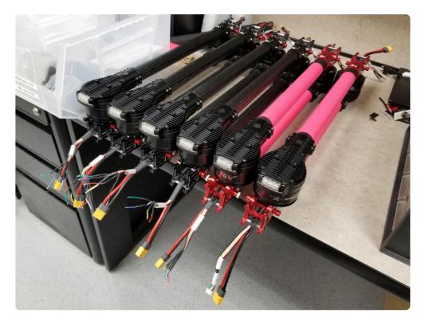
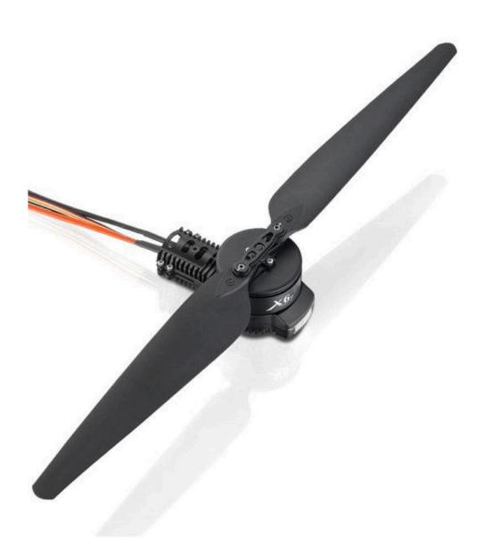

## LAM6 - Manufacturing Information

The LAM6 hardware was designed in SolidWorks and these native files will be provided along
with the manufacturing files such as .dxf (for carbon fiber plate CNC) and .Obj / STL (for 3D
printing).

### Frame

The LAM6 frame is constructed of carbon fiber, aluminum, and in limited areas, 3D printed parts.
The frame is designed to use as few non-commodity parts as possible. This makes it easier to
find alternate sources and always be able to build a LAM6 or make repairs. Other than standard
hand tools, a CNC router and a 3D printer capable of printing in ASA or other similar high
temperature engineering materials are required. The only parts that are cut on the CNC router
are 2D carbon fiber plates up to 3mm thick. The router should have an effective cut area at the
very minimum of 350 x 350 mm.

It is also possible to use a CNC routing service to create the needed parts if you do not
have access to one, cost is not that significant, getting multiple quotes is always a good
idea.

Recommended Vendors:
  - [CNCmadness.com](https://cncmadness.com/services/cnc-machining/)

### Motor Arm Assembly

The motor arm assembly contains the integrated Motor / ESC system, 30mm carbon fiber arm
tube, the folding arm joint, and the power and data cables to the ESC. It is recommended to
build these first, the construct the center body around them, as the folding joints act as spacers
for the main frame plates.



2 Sets of motor arms near end of production



HobbyWing Xrotor Pro x6 Integrated propulsion assembly

### Body

### Legs

### Propulsion

### Electronics

### Parts Sourcing Guide

This Parts sourcing spreadsheet is intended to provide assistance finding certain critical
parts by listing multiple vendors when possible. This is not intended to be a complete or up-to-date list, It is important to understand what parts you need before blindly ordering
from this.

Link to google sheets: [File](https://docs.google.com/spreadsheets/d/1RQ2mvHIuNIZrp1jTcvHSAKMhwLwLN2pArzVKuHPfZEI/edit?usp=sharing)


```{toctree}
:maxdepth: 1
:titlesonly:

  Airframe Design Overview <airframe_design>
  Electronics Design Overview <electronics_design>