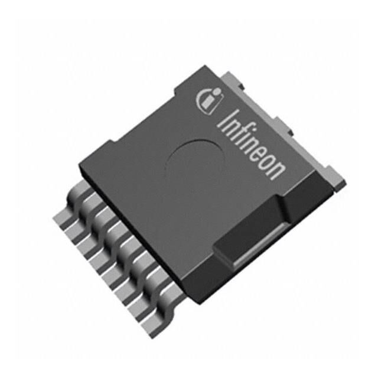

# LAM6 - Power Distribution Board (PDB)

The PDB handles the high current power distribution within the LAM6 UAV. The PDB connects
directly to 1 or 2 batteries supporting up to 200A per connection. It supplies power to up to 10
ESCs, 2 auxiliary devices, and the matching Flight Controller Carrier Board (FCCB). Two key
features of this PDB are current monitoring on each input connection and the ability to switch
the power on / off to the ESC connections. This board stacks vertically under the FCCB and
makes connection with 4 headers keyed so the board can only be connected the correct way.

The total current handling capability is determined by the copper thickness and PCB substraight (FR4 vs Aluminum) it is manufactured with. The hole in the center is for airflow from an
externally mounted fan to flow against the underside of the FCCB and over both the top and
bottom surface of the PDB. Although verification is needed, the PDB is designed for continuous
operation at 340A with a fan, 4oz copper, and an Al sub-straight.

<table>
<tr>
<td>

  
Render of PDB [shown without battery input wires]

</td>
<td>

**Current Sensing:** 2 x 200A Hall-effect Sensors 

**Battery Input:** 2 x 200A 8AWG connections (80V MAX
input)

**Switched Outputs:** 10 x XT60-F

**Fixed Aux Outputs:** 2 x XT30-F 

  - Needs to be connected to a FCCB with suitable high side N-channel MOSFET driver.  
  - Not all MOSFETs & ESC XT60 connectors need to be populated.  
  - 2 onboard temp sensors with analog voltage output.  
  - Supplies up to 24A of un-switched battery power to FCCB through stacking headers.
  - Not intended to be used without FCCB.

</td>
</tr>
</table>

## Technical information:

<table>
<tr>
<td valign="top">

  
**PCB Layout View**  

**Fabrication / Assembly Notes**  
- Minimum 2 Oz copper thickness for use with LAM6 (Forced air cooling required)  
- 0.25mm min trace width  
- Reflow soldering highly recommended for MOSFETS & temp sensors (before any THT components)  
- 60W+ Direct-heat style soldering Iron recommended for other components  

</td>
<td valign="top">

  
**PDB Schematic**  

### Temperature Sensing
There are two [Texas Instruments LMT87](https://www.ti.com/product/LMT87#order-quality) ICs on the top side of the PCB located close to two MSOFETS.

  

Each IC is powered by the same 5V source that is provided via the 0.1” stacking headers from the FCCB. This 5V source is shared with the Hall-effect current sensors. 

A 0.1uF decoupling cap is located adjacent to each IC.  

  

Response time of only the IC, not including effects from imperfect thermal coupling with PCB. 

Keep in mind during large current pulls this sensor (like most temp sensors) will have a significantly delayed response. It is absolutely possible exceed the maximum thermal ratings of components before the temperature reading catches up.

</td>
</tr>
</table>

<table>
<tr>
<td valign="top">

**Switch MOSFETS**

The PDB is designed to use the [Infineon IAUS300N08S5N012](https://www.digikey.com/en/products/detail/infineon-technologies/IAUS300N08S5N012ATMA1/9816189) - [data sheet](https://aerpaw-uav.atlassian.net/wiki/download/attachments/147062839/Infineon-IAUS300N08S5N012-DataSheet-v01_01-EN.pdf?api=v2)

**Specifications:**
- **VDS:** < 80V
- **RDS(ON):** ~1.2 mOhm
- **ID:** < 300A
- **TJ:** < 175°C
- **Package:** [PG-HSOG-8-1](https://www.infineon.com/cms/en/product/packages/PG-HSOG/PG-HSOG-8-1/)
- **Marking:** A08S5N12

</td>
<td valign="top">

  

</td>
</tr>
</table>

| File                                              | Changed                 |
|---------------------------------------------------|--------------------------|
| [image-20211025-014354.png](https://aerpaw-uav.atlassian.net/wiki/download/attachments/147062839/image-20211025-014354.png?api=v2)                         | Oct. 25, 2021 by [Mark Funderburk](https://aerpaw-uav.atlassian.net/wiki/people/70121:2011c6b7-a87c-4558-b262-6e5195fa047c?ref=confluence) |
| [image-20211025-014659.png](https://aerpaw-uav.atlassian.net/wiki/download/attachments/147062839/image-20211025-014659.png?api=v2)                         | Oct. 25, 2021 by [Mark Funderburk](https://aerpaw-uav.atlassian.net/wiki/people/70121:2011c6b7-a87c-4558-b262-6e5195fa047c?ref=confluence) |
| [image-20211025-015914.png](https://aerpaw-uav.atlassian.net/wiki/download/attachments/147062839/image-20211025-015914.png?api=v2)                         | Oct. 25, 2021 by [Mark Funderburk](https://aerpaw-uav.atlassian.net/wiki/people/70121:2011c6b7-a87c-4558-b262-6e5195fa047c?ref=confluence) |
| [PDB.pdf](https://aerpaw-uav.atlassian.net/wiki/download/attachments/147062839/PDB.pdf?api=v2)                         | Oct. 25, 2021 by [Mark Funderburk](https://aerpaw-uav.atlassian.net/wiki/people/70121:2011c6b7-a87c-4558-b262-6e5195fa047c?ref=confluence) |
| [image-20211025-025835.png](https://aerpaw-uav.atlassian.net/wiki/download/attachments/147062839/image-20211025-025835.png?api=v2)                         | Oct. 25, 2021 by [Mark Funderburk](https://aerpaw-uav.atlassian.net/wiki/people/70121:2011c6b7-a87c-4558-b262-6e5195fa047c?ref=confluence) |
| [image-20211025-025848.png](https://aerpaw-uav.atlassian.net/wiki/download/attachments/147062839/image-20211025-025848.png?api=v2)                         | Oct. 25, 2021 by [Mark Funderburk](https://aerpaw-uav.atlassian.net/wiki/people/70121:2011c6b7-a87c-4558-b262-6e5195fa047c?ref=confluence) |
| [Infineon-IAUS300N08S5N012-DataSheet-v01_01-EN.pdf](https://aerpaw-uav.atlassian.net/wiki/download/attachments/147062839/Infineon-IAUS300N08S5N012-DataSheet-v01_01-EN.pdf?api=v2)                         | Oct. 25, 2021 by [Mark Funderburk](https://aerpaw-uav.atlassian.net/wiki/people/70121:2011c6b7-a87c-4558-b262-6e5195fa047c?ref=confluence) |
| [ACS770-Datasheet.pdf](https://aerpaw-uav.atlassian.net/wiki/download/attachments/147062839/ACS770-Datasheet.pdf?api=v2)                         | Oct. 25, 2021 by [Mark Funderburk](https://aerpaw-uav.atlassian.net/wiki/people/70121:2011c6b7-a87c-4558-b262-6e5195fa047c?ref=confluence) |
| [lmt87_Datasheet.pdf](https://aerpaw-uav.atlassian.net/wiki/download/attachments/147062839/lmt87_Datasheet.pdf?api=v2)                         | Oct. 25, 2021 by [Mark Funderburk](https://aerpaw-uav.atlassian.net/wiki/people/70121:2011c6b7-a87c-4558-b262-6e5195fa047c?ref=confluence) |
| [image-20211025-032225.png](https://aerpaw-uav.atlassian.net/wiki/download/attachments/147062839/image-20211025-032225.png?api=v2)                         | Oct. 25, 2021 by [Mark Funderburk](https://aerpaw-uav.atlassian.net/wiki/people/70121:2011c6b7-a87c-4558-b262-6e5195fa047c?ref=confluence) |
| [image-20211025-034127.png](https://aerpaw-uav.atlassian.net/wiki/download/attachments/147062839/image-20211025-034127.png?api=v2)                         | Oct. 25, 2021 by [Mark Funderburk](https://aerpaw-uav.atlassian.net/wiki/people/70121:2011c6b7-a87c-4558-b262-6e5195fa047c?ref=confluence) |
| [image-20211025-034519.png](https://aerpaw-uav.atlassian.net/wiki/download/attachments/147062839/image-20211025-034519.png?api=v2)                         | Oct. 25, 2021 by [Mark Funderburk](https://aerpaw-uav.atlassian.net/wiki/people/70121:2011c6b7-a87c-4558-b262-6e5195fa047c?ref=confluence) |
| [image-20211025-035107.png](https://aerpaw-uav.atlassian.net/wiki/download/attachments/147062839/image-20211025-035107.png?api=v2)                         | Oct. 25, 2021 by [Mark Funderburk](https://aerpaw-uav.atlassian.net/wiki/people/70121:2011c6b7-a87c-4558-b262-6e5195fa047c?ref=confluence) |
