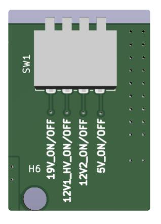

# Large Portable Node Power Board

### Block Diagram

### Description

The Large Portable Node Power Board is a Power Distribution Board for the Big Drone’s Portable
Node. It takes a 48V input from the Battery or a 19V input from Auxiliary Power to power the 19V
NUC, 12V High Power Loads (RFSoCs), additional 12V loads, and 5V loads.

The 48V Battery Power and 19V Aux Power rails run through an ORing Controller whose output
voltage is converted to 19V using DC-DC Converter U3. The 19V is used to power the NUC and
is also stepped down using additional DC-DC Converters U4, U6, U5 to supply the two 12V rails
and one 5V rail respectively.

Further, each input connector and 12V, 5V output connectors have fuses for over-current
protection. The power supplies also have fuses on their inputs for the same.

### PCB Images

*Top Layer*

*Bottom Layer*

### Operation

Each Output voltage rail can be turned ON/OFF using DIP Switch SW1. The voltage rail that
corresponds to each switch is noted on the PCB Silkscreen as below:

There are:
- 1 Barrel Jack Connector for the 19V NUC
- 4 4-pin 5024940470 Clik-mate connectors for 5V Loads
- 2 8-pin 5024940870 Clik-mate connectors for the 12V High Power (RFSoCs) Loads
- 4 6-pin 5024940670 Clik-mate connectors for other 12V Loads

The Battery Power uses 1 XT30PW-F Connector while Auxiliary Power allows input from either
an additional XT30PW-F Connector or a Barrel Jack Connector. **<i>When powering through Aux
Power, ensure to not power the board using both the Barrel Jack and XT30 Connector.</i>**

### Debugging

Each Input and Output voltage rail has an LED to identify the presence of voltage on those rails.

- D6 Input 48V Battery Power
- D5 Input 19V Auxiliary Power
- D7 19V DC-DC Converter Output
- D8 Output 5V Loads
- D11 Output 12V High Power Loads(RFSoCs)
- D10 Output 12V2 Loads
- D9 Output 19V NUC

Each Input and Output Voltage Rails have Circular Test pads, by the connectors, which can be
identified using the Silkscreen. Square Test pads are GNDs. Further, each Power Supply has a
test pad for its Power Good Signal.

The connector part numbers are printed on the Silkscreen on the bottom layer of the PCB, under
the respective connector.
