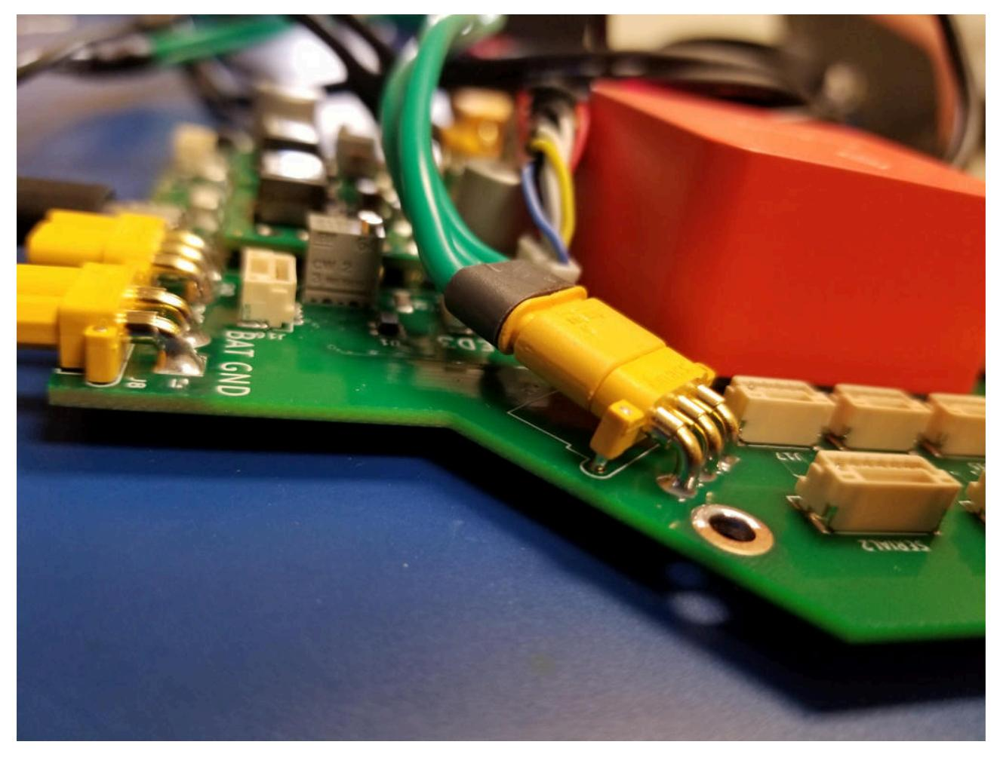
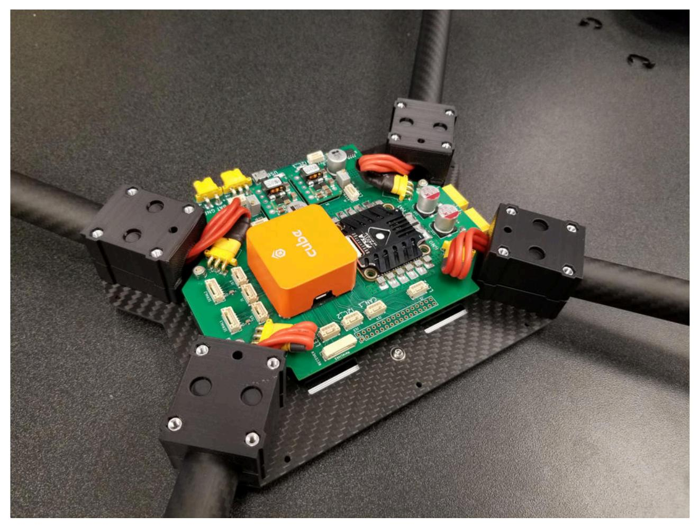

## SAM4 Bring-Up notes

Status: Passed initial checks (with errors), proceeding to implement temporary fixes (USB connector, XT60 PCB side reversal).

Next step: install in drone.

Initial Observations:

- Should have Power indication LEDs
- Better Labeling of CAN connectors
- During assembly it was obvious the MR30 connectors did not have clearance, this was fixed by tilting the connectors upwards before soldering. This makes connections very easy but was tedious to do and may not be the most secure.

1. Tested battery power inputs without CUBE attached  
   - Found XT60 connectors positive and negative reversed (footprint issue?)  
     - Can be fixed for now by flipping power leads or soldering them on the bottom of the PCB  
   - Both 5V supplies are working correctly  

2. Added CUBE to board, tested initially with PCB USB connection  
   - Nothing detected on PC side  
     - Issue was bad solder joint due to incorrect footprint, was able to make temporary connection by holding connector down manually  
     - Now fixed on test board by re-soldering a new connector with extreme care (not a permanent solution).
     - 
 
3. Tested CUBE with integrated USB plug  
   - Working as expected, installed latest firmware and live data is reported  
   - Added HERE3 GPS, UAVCAN working as expected  
   - Tested buzzer, working as expected  

4. Tested CUBE when powered from Battery Input  
   - Initial tests pass  
     - CUBE boots  
     - GPS is powered and NTF LEDs working  
     - Buzzer still works  

5. Tested ESC by configuring Arducopter on CUBE  
   - D-shot 1200 working  
   - Able to spin all motors in motor test  
   - ESC telemetry connection working  
     - ESC reports correct battery voltage to Ardupilot  
   - Next step: test BL-Heli passthrough  

6. Connect Herelink for testing  
   - Herelink fully functional  
     - Power  
     - Telemetry  
     - RC control  
   - Was able to arm & disarm with Herelink controller, spin motors at arming speed on bench  

7. Tested Serial 1 & 2 connections (using Herelink as I could not find an RFD900 cable)  
   - No issues  

8. Tested CANBUS 1 & 2 working with multiple GPSs connected  

9. GPS blending tested with two Here3 GPSs  
   - Noticeable improvement in position given it is barely possible to get any GPS lock at all in the lab  
     - (This feature was not available before Arducopter 4.1)  

10. Auxiliary power outputs show correct voltage on correct pins  

11. Both "5V3" power supplies set to 5.12V.
    - This was the highest level they both could be adjusted to, will need to investigate why, the POT was not out of turns but the voltage stopped increasing.

12. Further testing was conducted with the PCB installed in the drone.

  - Since the XT60 connectors had to be mounted on the underside of the PCB, the mounting height had to be increased to 10mm vs the 5mm that was planned. This caused issue with the HERElink mounting as it did not have space above the PCB. To fix this, spacers were used on the arm mounts to increase the height of the top plate by 5mm. Even with this extra space the angled MR30 connectors pressed against the herelink. It was barely possible to install the top plate.

13. Configuring ESC.
    - The ESC was able to be configured through the BL-Heli suite utilizing Ardupilot passthrough (through the CUBEs USB)
      - It was found with these new heavier motors, "Low RPM Power Protection" needed to be turned off on the ESC, otherwise the motors were not allowed to spin up past ~15% throttle. After some investigation it seems this is recommenced for larger (non fpv) drones with his type of ESC.
      - Motor direction was set within the BLheli-32 configurator. This should be done individually for every drone but on this one, motors 1, 3, 4 needed to be reversed.
      - After configuration, I set the LED color to blue (default is red) to indicate this ESC had been configured and is ready.

14. Current monitoring.
    - Ardupilot is able to correctly read the current sensor built into the ESC, the settings are in the parameters document.
    - Ardupilot is able to read the Aux current sensor correctly as well, settings also in document.
    - Ardupilot was able to be setup to combine the current for each sensor together in the primary battery display channel, however, battery capacity monitoring is not working when combing multiple batteries. This seems to be a bug in Ardupilot.

15. Battery voltage monitoring
    - Working and accurate.
16. Drone was tested with props installed, fixed down to cart in the lab, up to 75% throttle and at a sustained 30A draw for ~60 seconds with no issues.
17. Ready for field testing.
